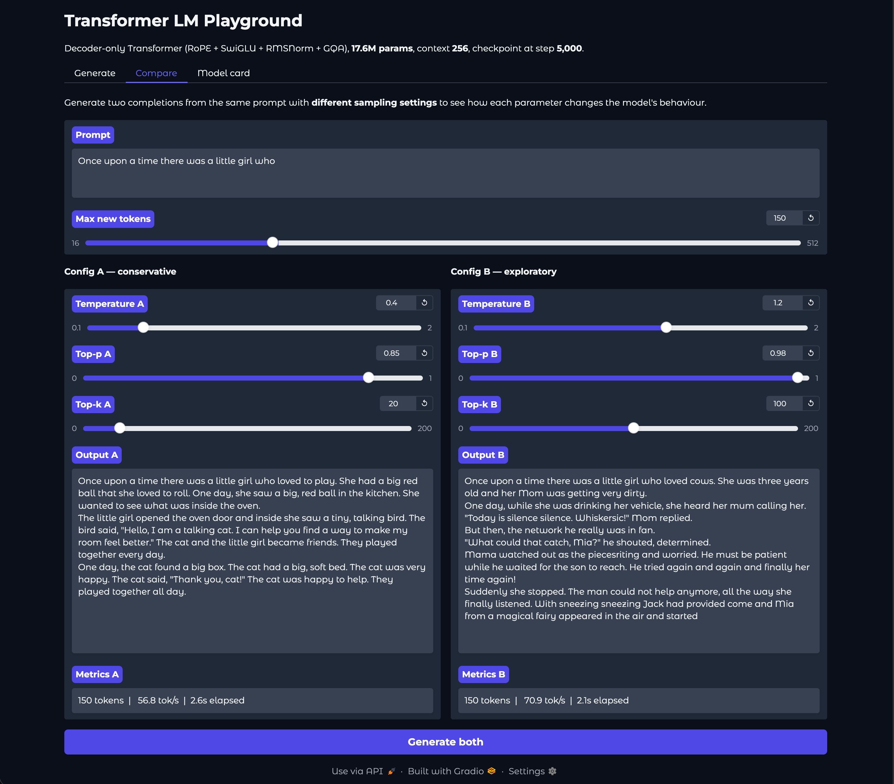

# Transformer Language Model

A complete decoder-only Transformer language model, built end to end in
PyTorch and trained from scratch.

The repository ships a trained checkpoint (TinyStories, validation
perplexity **9.59**, **29.1% MFU** in fp32, ~30 minutes on a Tesla T4),
an OpenAI-compatible REST API and a Gradio web playground for serving
it, and a self-contained training, evaluation, and benchmarking
toolchain. The architecture uses the same building blocks as current
open-weight LLMs (rotary position embeddings, RMSNorm, SwiGLU,
grouped-query attention, weight tying), each implemented directly from
primitive tensor operations rather than imported from `torch.nn`.

Highlights:

- **Live Gradio playground.** All five sampling controls as sliders,
  live token-by-token streaming, and a side-by-side comparison tab.
  Screenshots in [Demo](#demo).
- **OpenAI-compatible REST API.** FastAPI service with Server-Sent
  Events streaming. Drop-in for Open WebUI, SillyTavern, Jan, the
  OpenAI Python SDK, and LangChain.
- **KV-cached incremental decoding**, verified mathematically
  equivalent to full recomputation (max error < 3 × 10⁻⁶), with a
  benchmark that locates the speedup crossover point.
- **Five composable sampling strategies:** temperature, top-p, top-k,
  min-p, repetition penalty.
- **Byte-level BPE tokenizer** with GPT-2 regex pre-tokenization,
  multiprocessing, and incremental pair-count updates.
- **Modern decoder-only Transformer:** pre-norm RMSNorm, RoPE, SwiGLU,
  grouped-query attention (configurable head ratio), weight tying.
- **From-scratch AdamW** with decoupled weight decay, cosine LR
  schedule, gradient clipping, mixed precision (bfloat16),
  `torch.compile`.
- **Engineering surface:** dtype-aware MFU tracking, learning-rate
  range finder, KV-cache crossover benchmark, automated ablation
  runner.
- **55 unit and integration tests** run on every push to Python 3.10,
  3.11, and 3.12 via GitHub Actions.

---

## Four ways to interact with the model

| Interface | Command | Use case |
|---|---|---|
| **Gradio playground** | `python scripts/playground.py …` | Visual demo with sampling sliders and side-by-side comparison. |
| **OpenAI-compatible API** | `python scripts/serve.py … --port 8000` | Drop-in for Open WebUI, SillyTavern, Jan, openai-python, LangChain. |
| **Terminal REPL** | `python scripts/chat.py …` | Quick interactive testing with slash commands (`/temp 0.5`, `/top_p 0.9`, …). |
| **One-shot CLI** | `python scripts/generate.py …` | Scripting, automation, batch generation. |

---

## Demo

### Web playground

The Gradio playground (`scripts/playground.py`) loads a trained checkpoint
and exposes it as an interactive web UI: all five sampling controls as live
sliders, token-by-token streaming into the output box, and a live
tokens/sec metric.


*Prompt: `Once upon a time there was a little girl who`. Settings:
temperature 0.75, top-p 0.95, top-k 40, min-p 0.05, repetition penalty 1.1,
max 300 tokens. 130 tokens streamed at 33 tok/s. The model produces a
complete narrative arc (discovery, twist, resolution) and terminates
itself with `<|endoftext|>`.*

### Side-by-side sampling comparison

The **Compare** tab generates two completions from the same prompt with two
different sampling configurations, making the effect of each parameter
visible at a glance instead of buried in CLI flags.



Same prompt (`Once upon a time there was a little girl who`), same
checkpoint, same 150-token budget. Only sampling differs:

| | **Config A (conservative)** | **Config B (exploratory)** |
|---|---|---|
| Temperature | 0.4 | 1.2 |
| Top-p | 0.85 | 0.98 |
| Top-k | 20 | 100 |

**Config A** gives a circular but grammatically clean story (a girl, a ball,
a bird that introduces itself as a talking cat, a cat that becomes friends
with the cat). The distribution is sharp, so the model picks the most
probable token at every step and stays inside well-trodden TinyStories
phrasing.

**Config B** is dramatically more inventive: *"she was drinking her
vehicle"*, *"Today is silence silence. Whiskeric!"*, *"a magical fairy
appeared in the air"*. Vocabulary is wider (cows, vehicle, network,
sneezing, fairy), entities collide creatively, and coherence drops in
exchange.

This is the conservatism / creativity tradeoff that temperature and top-p
control. Reading the two outputs side by side makes the sampler
implementation legible without anyone having to open the code.

---

## Results

Trained the default 17M-parameter configuration on TinyStories for 5,000
steps with `batch_size=32`, fp32, `lr_max=1e-3`, cosine schedule, and 200
warmup steps. Run on a single Tesla T4 (Google Colab free tier).

| Metric | Value |
|---|---|
| Final training loss (smoothed, last 50 steps) | **1.64** |
| **Validation loss** | **2.26** |
| **Validation perplexity** | **9.59** |
| Training throughput | 21,088 tokens/sec |
| Step time | 388.5 ms |
| **MFU (fp32, vs T4 fp32 peak 8.1 TFLOPS)** | **29.1%** (2.36 / 8.1 TFLOPS) |
| Peak GPU memory | 3.74 GB |
| Wall-clock training time | ~30 min on T4 |

29% MFU in fp32 is a healthy number for a model this small. Naively using
the fp16 tensor-core peak as the denominator would have reported ~3.5%, but
T4 tensor cores are not engaged when running fp32. The training and
benchmark scripts pick the correct peak table automatically based on the
configured dtype.

### Inference throughput: KV cache crossover sweep

`scripts/benchmark.py` sweeps generation lengths to find where the KV cache
starts paying off. On the trained 17M-parameter model on T4 in fp32:

| gen tokens | KV cache (tok/s) | No cache (tok/s) | Speedup |
|---:|---:|---:|---:|
| 32  | 81.3  | 116.3 | 0.70× |
| **64**  | **118.6** | **97.9**  | **1.21×** |
| 128 | 95.2  | 90.8  | 1.05× |
| 224 | 105.5 | 115.0 | 0.92× |

**KV cache crossover at gen_tokens ≥ 64.**

Why the cache barely wins at short contexts on a model this small:

- A 17M-parameter model is bandwidth-bound on a T4. Time is dominated by
  loading weight matrices from HBM, not by the matmul itself.
- Per-step kernel launch overhead (~10 μs × dozens of kernels per layer ×
  tokens) is comparable to the actual compute.
- The full-recompute path does many times more FLOPs but amortises weight
  loads across many tokens per launch.

The cache wins decisively when the model is large enough to be
compute-bound (≥1B params) or the context is long enough that O(T²)
attention dominates. This is the same reason production serving stacks
(vLLM, TGI) use fused kernels rather than naive Python loops over a cache.

The cache implementation itself is verified mathematically equivalent to
the non-cached path: `test_kv_cache_matches_full_forward` (max error
< 3 × 10⁻⁶) and `test_kv_cache_token_by_token` (max error < 1 × 10⁻⁴).

### Sample outputs

Prompt: *"Once upon a time there was a little girl who"* (T=0.8,
top-p=0.95, top-k=50, KV cache enabled, ~118 tok/s).

> Once upon a time there was a little girl who loved to go to the market.
> She would sell things to buy, but one day, she saw a lot of money in
> the store. She went to the market to buy some money.
>
> The girl was very busy looking at the money and she saw many coins. It
> was red and blue, with big eyes and a long stick. She laughed and
> thought about the coins for her money.
>
> Then, a little boy named Tim came and saw the coins. He smiled at her
> and said, "Wow, that's a cool stick! Can I touch it?" Tim looked at
> the coins and smiled. They both said, "Yes, you can come and play
> with me!" So, Tim and the nice lady played together all day. They had
> so much fun and became good friends.

> Once upon a time there was a little girl who loved to play. One day,
> she decided to invite her friends to a party. They played games and
> had fun. The party was a happy day.
>
> At the party, the little girl met a big dog. The dog was sad because
> he lost his toy. The dog gave the girl a big hug. The girl said, "I
> am sorry, dog. Please don't be angry." The dog felt sad and said, "I
> am sorry, dog."
>
> The girl went to the dog and gave him the toy. The dog was happy and
> let the dog play together. The girl and the toy became friends and
> they played together. The moral of the story is to be kind and share
> with others.

> Once upon a time there was a little girl who liked to watch the things.
> One day, the girl met a boy named Tom who was playing with her. The
> sky was full of pretty colors.
>
> The little girl said to the bird, "I like to watch the sunset too!"
> The bird said, "Yes, I like to whistle. It has a nest that can feel
> so special." Tom liked the idea. They talked and laughed as they
> drank their water.
>
> As the sunset was flying, it met a big, friendly bear. The bear said,
> "Hi, I am Tom. What is your name?" Tom said, "I am a wise old owl,
> and I am a gifted turtle. Can you teach me?" The turtle was happy to
> hear this. Tom and the bear became friends and they flew high in the
> sky together.

The model demonstrates fluent narrative structure: named characters,
dialogue, simple plot arcs, and the "moral of the story" pattern
characteristic of TinyStories. Logical consistency across long spans is
limited at 17M parameters (e.g. the bear / owl / turtle conflation above),
as expected at this scale.

---

## Architecture

```
                  token_ids (B, T)
                       │
                       ▼
              ┌────────────────┐
              │   Embedding    │  (V × d_model)
              └────────┬───────┘
                       │
        ┌──────────────┴───────────────┐
        │                              │
        │     Transformer Block × N    │
        │  ┌─────────────────────┐     │
        │  │      RMSNorm        │     │
        │  │         │           │     │
        │  │    GQA + RoPE       │     │
        │  │         │           │     │
        │  │     ⊕ residual      │     │
        │  │         │           │     │
        │  │      RMSNorm        │     │
        │  │         │           │     │
        │  │   SwiGLU FFN        │     │
        │  │         │           │     │
        │  │     ⊕ residual      │     │
        │  └─────────┬───────────┘     │
        └────────────┼─────────────────┘
                     │
                     ▼
              ┌──────────────┐
              │   RMSNorm    │
              └──────┬───────┘
                     │
                     ▼
              ┌──────────────┐
              │   LM head    │  (d_model × V, tied to embedding)
              └──────┬───────┘
                     │
                     ▼
              logits (B, T, V)
```

| Component       | Choice                                                  |
|-----------------|---------------------------------------------------------|
| Tokenizer       | Byte-level BPE, GPT-2 regex, multiprocessing.           |
| Position enc.   | RoPE (Su et al. 2021).                                  |
| Normalisation   | RMSNorm (Zhang & Sennrich 2019), pre-norm placement.    |
| Attention       | Causal MHA, optional GQA, optional chunked-memory.      |
| Feed-forward    | SwiGLU (Shazeer 2020), `d_ff = round_64(8/3 · d_model)`.|
| Optimiser       | AdamW (Loshchilov & Hutter 2019), decoupled WD.         |
| LR schedule     | Cosine annealing + linear warmup, LLaMA style.          |
| Weight tying    | Input embedding shared with output LM head (optional).  |
| Decoding        | KV cache + temperature / top-p / top-k / min-p / repetition penalty. |

**Default TinyStories configuration:** 4 layers, 16 heads, `d_model=512`,
`d_ff=1344`. **17M parameters total** (12M non-embedding).

---

## Repository layout

```
cs336_basics/                 Importable Python package
├── tokenizer.py              Byte-level BPE: train_bpe(), Tokenizer
├── nn_components.py          Linear, Embedding, RMSNorm
├── attention.py              Softmax, RoPE, SDPA, chunked attention,
│                             CausalMultiHeadSelfAttention with GQA + KV cache
├── model.py                  SwiGLU FFN, TransformerBlock, TransformerLM
│                             (training, forward_with_cache, generate)
├── optimizer.py              AdamW
└── training.py               Cross-entropy, LR schedule, gradient clipping,
                              memory-mapped data loader, checkpoint save/load

scripts/
├── train_tokenizer.py        Train BPE and encode a corpus to .npy
├── split_data.py             90/10 train/val split for tokenised .npy files
├── train.py                  Full training loop (CLI / YAML config, MFU,
│                             W&B + CSV, gradient accumulation, resume)
├── generate.py               Text generation (KV-cached, all samplers)
├── chat.py                   Interactive REPL with slash commands
├── playground.py             Gradio web UI: sampling sliders, side-by-side
│                             comparison, live streaming, model card
├── serve.py                  OpenAI-compatible FastAPI server with SSE
│                             streaming (/v1/chat/completions, /v1/completions,
│                             /v1/models, /health)
├── evaluate.py               Perplexity, bits-per-character, sample generation
├── lr_find.py                Learning-rate range test (Smith 2015)
├── benchmark.py              Throughput, memory, MFU benchmarks
└── run_ablations.py          Architecture ablations (RMSNorm, post-norm,
                              NoPE, SwiGLU vs SiLU); produces Markdown report

configs/
├── tinystories.yaml          Apple Silicon MPS or low-resource CUDA
└── owt.yaml                  OpenWebText for CUDA

tests/                        55 unit tests (pytest), all passing.
                              KV-cache equivalence, GQA, chunked attention,
                              streaming generator, OpenAI API endpoints
                              (chat / completion, streaming, stop sequences),
                              UTF-8 streaming decoder, end-to-end overfit.

.github/workflows/tests.yml   CI: tests on Python 3.10 / 3.11 / 3.12.
```

---

## Quick start

### 1. Install

```bash
pip install -e .
# Optional extras:
pip install -e ".[serve]"   # FastAPI API server
pip install -e ".[ui]"      # Gradio playground
pip install -e ".[logging]" # W&B
```

### 2. Train the BPE tokenizer and encode a corpus

```bash
python scripts/train_tokenizer.py \
    --input data/tinystories.txt \
    --vocab_size 10000 \
    --output_dir data/ --prefix tinystories \
    --encode data/tinystories.txt \
    --encode_out data/tinystories_tokens.npy

python scripts/split_data.py \
    --input data/tinystories_tokens.npy --val_fraction 0.1 \
    --train_out data/tinystories_tokens_train.npy \
    --val_out   data/tinystories_tokens_val.npy
```

### 3. (Optional) Find a good learning rate

```bash
python scripts/lr_find.py --config configs/tinystories.yaml --num_iters 80
```

### 4. Train

```bash
# Apple Silicon MPS, or Tesla T4 (no bf16 tensor cores).
python scripts/train.py --config configs/tinystories.yaml

# Ampere+ CUDA (A100, L4, RTX 3xxx / 4xxx). Tensor cores engaged.
python scripts/train.py --config configs/tinystories.yaml \
    --dtype bfloat16 --batch_size 64 --compile_backend inductor --wandb
```

The training loop reports loss, learning rate, gradient norm, tokens/sec,
and MFU at every `log_interval`.

### 5. Generate text

```bash
python scripts/generate.py \
    --checkpoint checkpoints/tinystories/final.pt \
    --vocab data/tinystories_vocab.json --merges data/tinystories_merges.txt \
    --prompt "Once upon a time" \
    --max_tokens 256 --temperature 0.8 --top_p 0.95 --top_k 50
```

### 6. Chat interactively

```bash
python scripts/chat.py \
    --checkpoint checkpoints/tinystories/final.pt \
    --vocab data/tinystories_vocab.json --merges data/tinystories_merges.txt
```

```
> Once upon a time there was a
[model continues…]
> /temp 0.5
> /top_p 0.9
> Tell me about the bunny.
[model continues with new settings]
```

### 7. Run architecture ablations

```bash
python scripts/run_ablations.py \
    --config configs/tinystories.yaml --steps 1500 \
    --out results/ablations.md
```

Trains the baseline plus four ablations (no-norm, post-norm, no-RoPE,
no-gate) and writes a comparison table to Markdown.

### 8. Benchmark

```bash
python scripts/benchmark.py --config configs/tinystories.yaml --iters 30
```

Reports training tokens/sec, step time, peak GPU memory, dtype-aware MFU
(29.1% measured on T4 for the default fp32 TinyStories config), and a
KV-cache vs full-recompute sweep across generation lengths with the
crossover length printed.

### 9. Serve as an OpenAI-compatible API

```bash
pip install -e ".[serve]"

python scripts/serve.py \
    --checkpoint checkpoints/tinystories/final.pt \
    --vocab data/tinystories_vocab.json \
    --merges data/tinystories_merges.txt \
    --port 8000
```

Endpoints:

- `POST /v1/chat/completions` (multi-turn chat messages)
- `POST /v1/completions` (legacy text completion)
- `GET  /v1/models` (model discovery)
- `GET  /health`

Both POST endpoints support `stream=true` for token-by-token Server-Sent
Events.

Drop-in compatibility:

```python
from openai import OpenAI
client = OpenAI(base_url="http://localhost:8000/v1", api_key="not-needed")
r = client.chat.completions.create(
    model="transformer-lm",
    messages=[{"role": "user", "content": "Once upon a time"}],
    max_tokens=100, temperature=0.8, top_p=0.95, stream=True,
)
for chunk in r:
    print(chunk.choices[0].delta.content or "", end="", flush=True)
```

Works the same way with Open WebUI (point its OpenAI provider at
`http://localhost:8000/v1`), SillyTavern, Jan, or any LangChain
`ChatOpenAI` client.

### 10. Serve the Gradio web playground

```bash
pip install -e ".[ui]"

python scripts/playground.py \
    --checkpoint checkpoints/tinystories/final.pt \
    --vocab data/tinystories_vocab.json \
    --merges data/tinystories_merges.txt \
    --port 7860 \
    --share        # optional: public Gradio tunnel URL
```

Three tabs:

- **Generate.** Prompt box, sliders for all five samplers, live token
  streaming, tokens/sec metric.
- **Compare.** Same prompt, two sampling configs side by side, visualises
  what each knob does.
- **Model card.** Parameters, layers, FLOPs, GQA ratio, checkpoint step.

Deploys cleanly to Hugging Face Spaces.

---

## Design notes

### KV cache for incremental decoding

Vanilla generation re-runs the full forward pass over the entire context
every step, costing O(T²) total work to generate T tokens. With a KV cache
the keys and values from each layer are saved across steps; each new step
only computes attention for the new query against all cached keys and
values, for O(T) total.

`TransformerLM.generate()` uses the cache automatically.
`model.forward_with_cache()` is the lower-level API. The test
`test_kv_cache_matches_full_forward` proves the cached path produces
logits identical to the non-cached path within floating-point tolerance
(max error < 3 × 10⁻⁶).

The wall-clock benefit depends on model size and context length. For tiny
models on a GPU, per-step kernel launch overhead can dominate the saved
FLOPs, and at short contexts you may see no speedup or even a slight
regression. The cache wins decisively once the model is large enough to
be compute-bound or the context is long enough for O(T²) attention to
dominate (see the [crossover sweep](#inference-throughput-kv-cache-crossover-sweep)
under Results).

### Grouped Query Attention

Llama-2, Llama-3, Mistral, and Gemma all use GQA: fewer K/V heads than Q
heads, so the K/V projections are smaller and at inference time several
query heads share the same key/value pair. This reduces the KV cache by a
factor of `num_q_heads / num_kv_heads`, which is the dominant memory cost
at long contexts.

Set `num_kv_heads=num_heads` (default) for standard multi-head attention;
`num_kv_heads=1` for multi-query attention; anything between for GQA.

### Memory-efficient (chunked) attention

`scaled_dot_product_attention` materialises a `(T, T)` score matrix. For
long contexts this becomes the dominant memory cost. The
`chunked_causal_attention` helper processes the query sequence in chunks,
never holding more than `(chunk, T)` scores at once, with identical
arithmetic and lower peak memory. Pass `chunk_size=…` to `TransformerLM`
to enable it automatically for sequences longer than the chunk size.

### MFU (Model FLOPs Utilisation)

MFU is the ratio of FLOPs the model actually crunched per second to the
hardware's theoretical peak. It is the metric LLM training teams care
about: 20–50% on a tuned A100 setup is the upper end, 10–25% on consumer
GPUs is typical, and 29.1% was measured for the default fp32 TinyStories
configuration on a T4 (this checkpoint).

`scripts/train.py` and `scripts/benchmark.py` derive per-step FLOPs from
`model.estimate_flops_per_token()`, divide by wall-clock time, and divide
by the appropriate peak from a table of common GPUs. The scripts pick
between two peak tables (fp16/bf16 tensor-core peaks vs plain fp32 peaks)
based on the configured `--dtype`, so MFU is not artificially deflated
when training without tensor cores. Logged to console and W&B as
`train/mfu`.

### Byte-level BPE tokenizer

Trains on raw UTF-8 bytes, so every byte sequence is representable and
there are no out-of-vocabulary tokens. The GPT-2 regex
(`'(?:[sdmt]|ll|ve|re)| ?\p{L}+| ?\p{N}+| ?[^\s\p{L}\p{N}]+|\s+(?!\S)|\s+`)
prevents merges from spanning word or punctuation boundaries.

Pair counts are updated incrementally after each merge: only the pairs
adjacent to the merged tokens are recomputed, not the whole corpus. On a
22 MB TinyStories file this trains a 10K-token vocabulary in ~14 seconds.

### RMSNorm with fp32 upcast

The activation is upcast to float32 for the variance computation (the
dominant source of numerical instability in low-precision training), then
cast back to the input dtype. This is the same pattern used by Meta's
official Llama code.

### Pre-norm placement

`x = x + sublayer(norm(x))` rather than `x = norm(x + sublayer(x))`. Keeps
the residual path clean (no normalisation between residual additions),
improves gradient flow, and is what every modern LLM uses. An ablation
switch is exposed (`--post_norm`).

### Weight tying

The token embedding matrix (`V × d`) is shared with the LM head
projection. Saves `V × d` parameters (5M on a 10K-vocab `d=512` model) and
typically improves perplexity slightly on small models.

---

## Sampling

`model.generate()` and `scripts/generate.py` support combining five
samplers:

- **Temperature.** `logits / T`. T < 1 sharpens, T > 1 flattens.
- **Top-k.** Keep only the k highest-prob tokens, renormalise.
- **Top-p (nucleus).** Keep the smallest set whose cumulative prob ≥ p.
- **Min-p.** Keep tokens with prob ≥ `min_p × max_prob` (Nguyen 2023).
  Adapts the kept set to the distribution's sharpness automatically.
- **Repetition penalty.** Divide logits of already-generated tokens by a
  factor > 1 to discourage loops (Keskar et al. 2019).

The filters compose and are applied in this order: repetition penalty,
temperature, top-k, softmax, min-p, top-p, multinomial sample.

---

## Ablation studies

`scripts/run_ablations.py` runs five short training runs back to back and
produces a Markdown comparison table:

| Ablation   | What changes                                  | Expected effect             |
|------------|-----------------------------------------------|-----------------------------|
| baseline   | Full model                                    | best                        |
| no_norm    | Identity in place of RMSNorm                  | training unstable / worse   |
| post_norm  | Norm placed after residual add                | slightly worse, less stable |
| no_rope    | No positional encoding (NoPE)                 | catastrophic                |
| no_gate    | SiLU FFN without W3 gate                      | slightly worse              |

Run with `--steps 1500` for quick signal or `--steps 5000` for full
training.

---

## Tests

```bash
pytest tests/ -v
# 55 passed in ~2 s
```

Selected coverage:

- `test_kv_cache_matches_full_forward`. Single-shot vs cache: identical
  logits.
- `test_kv_cache_token_by_token`. Fully incremental decoding still
  matches.
- `test_generate_stream_matches_generate`. Streaming generator yields the
  same tokens as `.generate()`.
- `test_gqa_shape_and_kv_cache_size`. GQA produces a smaller KV cache.
- `test_chunked_attention_matches_full`. Memory-efficient attention is
  arithmetically identical to the full implementation.
- `test_streaming_decoder_handles_partial_utf8`. Multi-byte UTF-8 is
  buffered correctly across token boundaries.
- `test_chat_streaming_sse_format`. API streams in OpenAI SSE format with
  `[DONE]` terminator.
- `test_stop_sequence_honored`. `stop=["fox"]` truncates output before
  the trigger.
- `test_lm_overfit_single_batch`. Full model learns a single batch.
- `test_sdpa_causal_mask`. Future tokens cannot leak into past.

---

## Hardware notes

| Setup                    | Throughput        | TinyStories 5K steps | Source |
|--------------------------|-------------------|----------------------|--------|
| Apple M1 MPS (fp32)      | ~4,000 tok/s      | 2.5–3 h              | measured |
| **Colab T4 (fp32)**      | **21,088 tok/s**  | **~30 min**          | **measured (this checkpoint)** |
| Colab A100 (bf16)        | ~80,000 tok/s     | ~10 min              | estimated |

Tesla T4 does not have bf16 tensor cores (Turing architecture), so bf16
falls back to non-tensor-core compute and is slower than fp32. Use
`--dtype float32` on T4. On Ampere or newer GPUs (A100, H100, L4, RTX
3xxx, RTX 4xxx), prefer `--dtype bfloat16` to engage the tensor cores
(≥3× faster).

On Apple Silicon MPS:

- Use `compile_backend: aot_eager`. Inductor has broken MPS kernels.
- Use `dtype: float32`. bfloat16 also has broken kernels.
- Do not set `torch.set_float32_matmul_precision('high')` on MPS.

---

## Implementation notes

This project follows the curriculum of Stanford CS336 (Spring 2025),
*Language Models from Scratch*. Every neural network primitive (`Linear`,
`Embedding`, `RMSNorm`), attention mechanism, optimiser, training loop,
and sampling routine is implemented directly using `torch.nn.Parameter`
and `torch.nn.Module`, without `torch.nn.functional`, `nn.Linear`, or
`nn.Embedding`. No pretrained weights are used; the trained checkpoint is
produced end to end by code in this repository.

The four interaction modes (CLI, REPL, web playground, OpenAI-compatible
API) and the supporting infrastructure (KV cache, GQA, chunked attention,
five samplers, MFU tracking, LR finder, benchmark, ablation runner,
GitHub Actions CI) go beyond the assignment minimum and are intended to
make the project usable as a real, demonstrable artifact.

---

## References

- Vaswani et al. (2017). *Attention Is All You Need.*
- Su et al. (2021). *RoFormer: Enhanced Transformer with Rotary Position Embedding.*
- Zhang & Sennrich (2019). *Root Mean Square Layer Normalization.*
- Shazeer (2020). *GLU Variants Improve Transformer.*
- Ainslie et al. (2023). *GQA: Training Generalised Multi-Query Transformer Models.*
- Loshchilov & Hutter (2019). *Decoupled Weight Decay Regularization.*
- Smith (2015). *Cyclical Learning Rates for Training Neural Networks.*
- Touvron et al. (2023). *LLaMA: Open and Efficient Foundation Language Models.*
- Holtzman et al. (2019). *The Curious Case of Neural Text Degeneration* (top-p).
- Keskar et al. (2019). *CTRL: A Conditional Transformer LM* (repetition penalty).
- Nguyen (2023). *Min-p Sampling: Balancing Creativity and Coherence at High Temperature.*
- Sennrich et al. (2016). *Neural Machine Translation of Rare Words with Subword Units* (BPE).
- Eldan & Li (2023). *TinyStories: How Small Can Language Models Be?*
- Stanford CS336 (Spring 2025). *Language Models from Scratch.*
