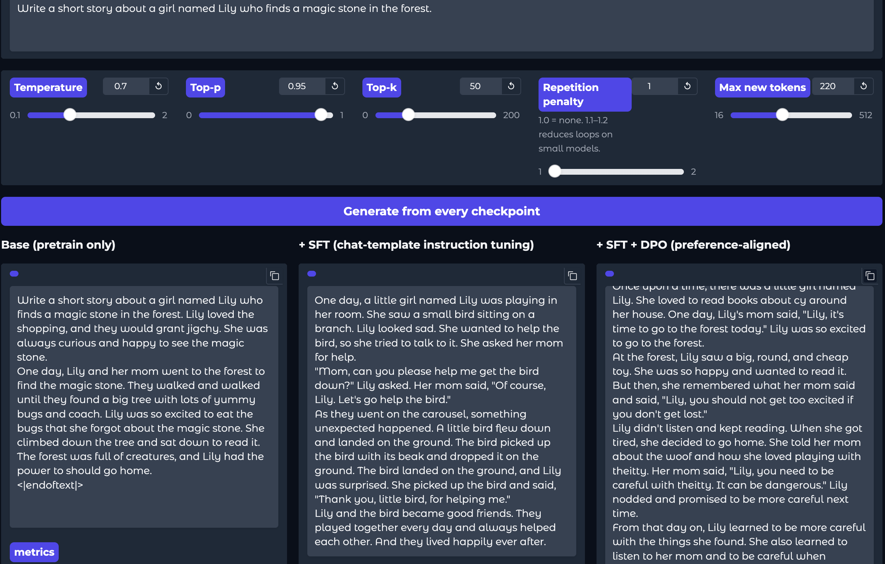
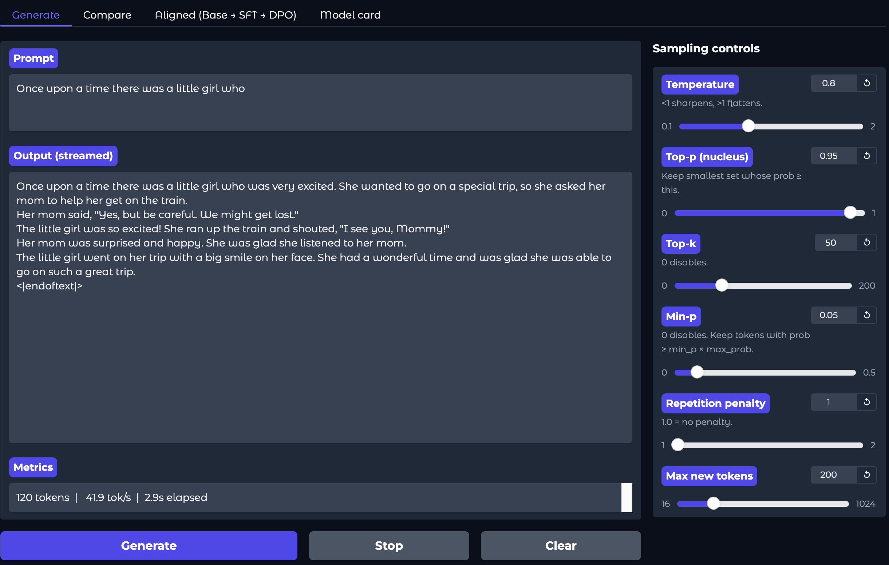

# Transformer Language Model — 60M, From Scratch

A decoder-only Transformer language model built end-to-end in PyTorch
using only `nn.Parameter` and raw tensor ops — **no `nn.Linear`, no
`nn.functional`, no HuggingFace TRL**. Pretrained at **60M parameters**
on TinyStoriesV2-GPT4, then put through the modern post-training stack
(masked-loss SFT and from-scratch Direct Preference Optimization),
then judged by a local LLM-as-judge harness with cross-validation across
two open-weight judges.

The whole pipeline — pretrain → SFT → preference labeling → DPO → eval —
runs end-to-end on Colab Pro for **~$20** with **zero external API
dependencies**.

**Headline numbers:** val PPL **17.19**, **228 K tok/s** at **26.2% MFU**
on a single Colab L4, DPO training-side reward margin grew **30×** over
600 steps.

[Live demo on HuggingFace Spaces](https://huggingface.co/spaces/pragadeeshsk/transformer-lm-60m) ·
[Sample outputs](#sample-outputs) ·
[Reproduce the pipeline](#reproduce-the-pipeline)

---

## The story

The project started as the Stanford **CS336 (Spring 2025)** curriculum
exercise — build a decoder-only Transformer from primitives — and
extended into a full from-scratch LLM pipeline with modern post-training
and rigorous evaluation. Four phases, one continuous build:

**1 · Correctness at 17M.** A small Llama-style stack (4 layers, 16 heads,
`d_model=512`, 17 M params) trained on the original TinyStories to val
PPL **9.59** on a Tesla T4 in fp32 (~30 min wall-clock, **29.1% MFU**).
This phase validated every primitive — RoPE, SwiGLU, RMSNorm with fp32
upcast, AdamW with decoupled weight decay, cosine schedule, KV cache —
before any scaling.

**2 · Scale to 60M.** Ten layers, ten query heads, two KV heads (Llama-3
style **5:1 GQA**), `d_model=640`, `d_ff=1728`, context 512, vocab 16 K.
A new byte-level BPE tokenizer was trained on TinyStoriesV2-GPT4 with the
chat-template specials `<|user|>`, `<|assistant|>`, `<|endoftext|>` baked
in at training time — so the post-training phase never needs an embedding
resize. 20 K steps in bf16 with `torch.compile` produced **val PPL
17.19**, **228 K tok/s**, **26.2% MFU** on a single Colab L4.

**3 · Post-training from scratch.** Masked-loss supervised fine-tuning
on TinyStoriesInstruct (loss masked to assistant-response tokens only),
6 K steps, **lr 3e-5**. Then preference-pair generation: sample two
completions per held-out prompt at *T*=0.9, prefilter near-duplicates,
and label with **Qwen2.5-7B-Instruct in 4-bit** running both orders per
pair (drop the ones where the judge flips). 178 swap-consistent pairs
survived from 516 candidates. Finally Direct Preference Optimization
(Rafailov et al. 2023) from a **frozen reference** of the SFT model,
600 steps at β=0.1 and lr 5e-6, asserted same dtype across policy and
ref to avoid spurious gradients. The full DPO loss is ~140 lines of
`nn.Parameter`-only code with numerically-stable `log σ` and shifted
log-softmax in [`cs336_basics/dpo.py`](cs336_basics/dpo.py).

**4 · Evaluation with bias controls.** Three checkpoints loaded
sequentially (memory-friendly on L4), 100–150 held-out prompts, **both
orders** of every pair judged, swap-consistency reported and inconsistent
pairs dropped. Then the entire eval was **cross-validated with a second
judge** (Qwen2.5-14B-Instruct) to test whether the win-rates were
judge-limited. They weren't — both judges agree the DPO-vs-SFT signal
sits inside the noise floor at this model scale, which is the documented
small-scale limit of preference learning and is honest to report. The
DPO training-side gradient is verified working (reward margin grew
**+0.01 → +0.36**, preference accuracy **45% → 87.5%** over 600 steps);
the judge just can't see the resulting output delta clearly enough at
53 M activations.

```
TinyStoriesV2-GPT4  ──►  pretrain (60M)  ─────────────────────►  base
                                          │
TinyStoriesInstruct ──►  masked-loss SFT  ┴───────────────────►  SFT
                                          │
SFT-sampled prompts ──►  sample 2 / prompt + heuristic prefilter
                       + Qwen2.5-7B judge (both orders + drop flippers)
                                          │
                          preference pairs ──►  DPO  ──────────►  DPO
                                          │
              held-out prompts ──►  Qwen-7B + Qwen-14B both-order
                                    judging + swap-consistency  ──► results
```

---

## Headline numbers

| Stage | Metric | Value |
|---|---|---|
| **60M pretrain (TinyStoriesV2-GPT4, L4, bf16)** | Val PPL | **17.19** |
| | Throughput | 228 K tok/s |
| | MFU | **26.2%** |
| | Wall-clock | ~48 min (20K steps) |
| **DPO training (600 steps, β=0.1)** | Reward margin (step ~20 → 600) | **+0.01 → +0.36** |
| | Preference accuracy (step ~20 → 600) | **45% → 87.5%** |
| **Eval: 3 × 3 win-rate matrix (Qwen-7B judge, 150 prompts, both orders)** | SFT beats Base | **38.0%** vs 10.0% |
| | DPO beats SFT | 31.3% vs 34.7% |
| | DPO beats Base | **32.7%** vs 10.0% |
| **Cross-validation (Qwen-14B judge, 75 prompts)** | Confirms DPO-vs-SFT at noise floor | sft-vs-dpo swap-consistency **36 – 66%** across both judges |
| **17M baseline (T4, fp32)** | Val PPL | 9.59 |
| | MFU | 29.1% |

The pre-training PPL is in standard token-space units; for the 16 K
byte-level BPE vocab the 17.19 PPL works out to ~1 bit per character —
close to the Shannon entropy floor for English. The 17M baseline is kept
as the proof-of-correctness data point; the 60M is the headline model.

---

## See it work

### Live demo

The [HuggingFace Space](https://huggingface.co/spaces/pragadeeshsk/transformer-lm-60m)
runs the **Aligned** playground: type one instruction and see the same
prompt go through all three checkpoints (base / SFT / DPO) in parallel.



The Generate tab streams a single model's output token-by-token with all
five sampling controls as live sliders.



### Sample outputs

Prompt (chat-template instruction for SFT/DPO, raw text for base):
*"Write a short story about a girl named Lily who finds a magic stone
in the forest."*  ·  *T*=0.7, top-p=0.95, top-k=50, rep_penalty=1.0,
max=220.

**Base (pretrain only).** Treats the instruction as a story opener and
continues it as raw text — no instruction-following.

> Write a short story about a girl named Lily who finds a magic stone in
> the forest. Lily loved the shopping, and they would grant jigchy. She
> was always curious and happy to see the magic stone. One day, Lily and
> her mom went to the forest to find the magic stone... `<|endoftext|>`

**+ SFT.** Recognises the chat-template instruction, produces a
structured story with dialogue.

> One day, a little girl named Lily was playing in her room. She saw a
> small bird sitting on a branch... She asked her mom for help.
> "Mom, can you please help me get the bird down?" Lily asked. Her mom
> said, "Of course, Lily. Let's go help the bird." ... And they lived
> happily ever after.

**+ SFT + DPO.** Same instruction-following plus the classic
preference-aligned moral-lesson closing that human-feedback training
tends to produce.

> Once upon a time, there was a little girl named Lily... her mom said,
> "Lily, you need to be careful with theitty. It can be dangerous."
> Lily nodded and promised to be more careful next time. From that day
> on, Lily learned to be more careful with the things she found. She
> also learned to listen to her mom and to be careful when playing and
> reading.

Visible 60M-scale artefacts (`jigchy`, `theitty`, mid-generation entity
drift) are characteristic of byte-level BPE on a small model and aren't
fully eliminated by more training — they're a scale ceiling. The
contrast across the three columns — text-continuation → instruction-
following → preference-aligned cozy moral — is the demonstration.

---

## Run it locally

### Option A — try the trained model (≈ 5 min)

Download the published checkpoints from the HuggingFace model repo and
launch the playground:

```bash
pip install -e ".[ui]"

# Pull the 3 checkpoints + tokenizer into ./hf_cache/
python -c "from huggingface_hub import snapshot_download; \
           snapshot_download('pragadeeshsk/transformer-lm-60m-tinystories', \
                             local_dir='hf_cache')"

# Launch the Aligned (base / SFT / DPO) playground
python scripts/playground.py \
    --checkpoint     hf_cache/base_60m/final.pt \
    --checkpoint_sft hf_cache/sft_v2/final.pt \
    --checkpoint_dpo hf_cache/dpo_v2/final.pt \
    --vocab  hf_cache/tinystories_v2_vocab.json \
    --merges hf_cache/tinystories_v2_merges.txt
```

Open <http://127.0.0.1:7860> in your browser. The **Aligned** tab is
where the base/SFT/DPO comparison lives; **Generate** is the streaming
single-model UI.

### Option B — generate from a single checkpoint, no UI

```bash
python scripts/generate.py \
    --checkpoint hf_cache/sft_v2/final.pt \
    --vocab  hf_cache/tinystories_v2_vocab.json \
    --merges hf_cache/tinystories_v2_merges.txt \
    --vocab_size 16000 --d_model 640 --num_layers 10 \
    --num_heads 10 --num_kv_heads 2 --d_ff 1728 --context_length 512 \
    --prompt "Once upon a time" --max_tokens 200 \
    --temperature 0.8 --top_p 0.95 --top_k 50
```

(See [`scripts/serve.py`](scripts/serve.py) for the OpenAI-compatible
API server, [`scripts/chat.py`](scripts/chat.py) for the REPL with
slash-commands.)

---

## Reproduce the pipeline

The two Colab notebooks in [`notebooks/`](notebooks/) wrap the full
sequence with Drive-mount + Colab-specific environment setup, and have
captured stdout from the actual runs that produced the headline numbers.
The bare command sequence:

```bash
pip install -e .

# 1) Download TinyStoriesV2-GPT4, train BPE w/ chat specials, encode + split
python scripts/download_tinystories_v2.py --vocab_size 16000 --output_dir data/

# 2) Pretrain the 60M base (~48 min on L4 bf16 + torch.compile)
python scripts/train.py --config configs/tinystories_60m.yaml --device cuda

# 3) Pack SFT examples from TinyStoriesInstruct (chat template + loss mask)
python scripts/build_sft_dataset.py \
    --vocab data/tinystories_v2_vocab.json \
    --merges data/tinystories_v2_merges.txt \
    --output data/tinystories_v2_sft.pt

# 4) Supervised fine-tune from the pretrain checkpoint
python scripts/train_sft.py \
    --base_checkpoint checkpoints/base_60m/final.pt \
    --sft_data        data/tinystories_v2_sft.pt \
    --checkpoint_dir  checkpoints/sft \
    --total_steps 6000 --batch_size 32 --lr_max 3e-5 \
    --device cuda --dtype bfloat16 --compile

# 5) Sample candidate preference pairs from SFT + heuristic prefilter
python scripts/build_preference_dataset.py \
    --sft_checkpoint checkpoints/sft/final.pt \
    --vocab  data/tinystories_v2_vocab.json \
    --merges data/tinystories_v2_merges.txt \
    --output data/pref_candidates.jsonl \
    --num_prompts 1000 --device cuda

# 6) Label preferences with local Qwen-7B judge in 4-bit (both orders)
python scripts/label_preferences.py \
    --input        data/pref_candidates.jsonl \
    --output       data/pref_labeled.jsonl \
    --judge_model  Qwen/Qwen2.5-7B-Instruct --load_in_4bit --device cuda

# 7) Direct Preference Optimization (policy + frozen ref, β=0.1)
python scripts/train_dpo.py \
    --sft_checkpoint checkpoints/sft/final.pt \
    --preferences    data/pref_labeled.jsonl \
    --vocab  data/tinystories_v2_vocab.json \
    --merges data/tinystories_v2_merges.txt \
    --checkpoint_dir checkpoints/dpo \
    --total_steps 600 --batch_size 4 --beta 0.1 --lr_max 5e-6 \
    --device cuda --dtype bfloat16

# 8) Eval: PPL + 3x3 pairwise win-rate matrix + swap-consistency → results.md
python scripts/eval_all.py \
    --base_checkpoint checkpoints/base_60m/final.pt \
    --sft_checkpoint  checkpoints/sft/final.pt \
    --dpo_checkpoint  checkpoints/dpo/final.pt \
    --val_data data/tinystories_v2_tokens_val.npy \
    --vocab    data/tinystories_v2_vocab.json \
    --merges   data/tinystories_v2_merges.txt \
    --judge_model Qwen/Qwen2.5-7B-Instruct --load_in_4bit \
    --output results.md --device cuda
```

End-to-end this takes ~6 hours on a single Colab L4 (with an A100
recommended for steps 6 and 8 if you use a 14B-or-larger judge). Total
compute cost: ~$20 on Colab Pro. No external API keys are used.

### Deploying the playground to HuggingFace Spaces

```bash
# One-off: push the trained checkpoints to a HF model repo
huggingface-cli login
python scripts/upload_checkpoints_to_hf.py \
    --repo_id <user>/<repo> \
    --base_checkpoint checkpoints/base_60m/final.pt \
    --sft_checkpoint  checkpoints/sft/final.pt \
    --dpo_checkpoint  checkpoints/dpo/final.pt \
    --vocab  data/tinystories_v2_vocab.json \
    --merges data/tinystories_v2_merges.txt
```

Then create a Space (Gradio SDK) and copy [`spaces/app.py`](spaces/app.py),
[`spaces/requirements.txt`](spaces/requirements.txt), and
[`spaces/README.md`](spaces/README.md) into it. Set the Space's
`MODEL_REPO` variable to your model repo id.

---

## How it works

### Architecture

```
        token_ids (B, T)
              │
              ▼
       Embedding (V × d_model)
              │
       ┌──────┴──────┐
       │  N × Block  │
       │  ┌────────┐ │
       │  │ RMSNorm│ │
       │  │   │    │ │
       │  │ GQA   │ │
       │  │ + RoPE │ │
       │  │   │    │ │
       │  │ ⊕ res  │ │
       │  │   │    │ │
       │  │ RMSNorm│ │
       │  │   │    │ │
       │  │ SwiGLU │ │
       │  │   │    │ │
       │  │ ⊕ res  │ │
       │  └────────┘ │
       └──────┬──────┘
              │
          RMSNorm
              │
        LM head (tied)
              │
              ▼
       logits (B, T, V)
```

| Component | Choice |
|---|---|
| Position encoding | RoPE (Su et al. 2021) |
| Normalisation | RMSNorm (pre-norm placement, fp32 upcast for variance) |
| Attention | Causal MHA with optional GQA and chunked-memory variant |
| Feed-forward | SwiGLU, `d_ff = round_64(8/3 · d_model)` |
| Optimiser | AdamW with decoupled weight decay |
| LR schedule | Cosine + linear warmup |
| Weight tying | Token embedding shared with LM head |
| Decoding | KV cache + temperature / top-p / top-k / min-p / repetition penalty |

**Primary config (60M, post-trained):** 10 layers · 10 query heads · 2 KV
heads (GQA 5:1) · `d_model=640` · `d_ff=1728` · `context_length=512` ·
`vocab_size=16000`. See [`configs/tinystories_60m.yaml`](configs/tinystories_60m.yaml).

### The from-scratch constraint

Every neural primitive — `Linear`, `Embedding`, `RMSNorm` — is
implemented directly with `torch.nn.Parameter` and `torch.nn.Module`,
without `torch.nn.functional`, `nn.Linear`, or `nn.Embedding`. Same rule
applies to the post-training layer: the masked-loss SFT trainer and the
DPO implementation use no HuggingFace TRL, no `torch.nn.functional`, no
external alignment libraries. The DPO loss
([`cs336_basics/dpo.py`](cs336_basics/dpo.py), ~140 lines) includes a
numerically stable `log σ` (`log σ(x) = -log(1 + exp(-x))` for x ≥ 0,
`x - log(1 + exp(x))` otherwise) and a shifted log-softmax for the
log-probability computation — the same pattern as the cross-entropy loss
in `training.py`.

### Post-training in detail

**Chat template + loss mask.** Conversations format as
`<|user|>{prompt}<|endoftext|><|assistant|>{response}<|endoftext|>`.
The loss mask is 1 only on the response tokens (assistant body + closing
EOT) and 0 on the prompt and the leading `<|assistant|>` marker — the
model is trained to *start* generating after the marker, not to predict
it. The mask is shifted left by 1 to align with the
`target_ids[t] = sequence[t+1]` convention.

**DPO loss.** Given preference pairs `(x, y_w, y_l)`:

```
L_DPO = -E[ log σ( β · ( log π_θ(y_w|x)/π_ref(y_w|x)
                       - log π_θ(y_l|x)/π_ref(y_l|x) ) ) ]
```

Policy and reference both forward the chosen and rejected responses with
the same loss mask. Critical correctness: policy and ref are loaded
twice into separately-allocated TransformerLMs and held in **matched
bf16** at log-prob computation time — dtype mismatch at this step
silently swamps the DPO signal. The trainer asserts dtype equality at
startup.

**Judge harness with bias controls.** Each candidate pair is judged in
**both orders**: `judge(A, B)` and `judge(B, A)`. Pairs where the verdict
flips are dropped (position bias). The remaining "swap-consistent" pairs
are reported as the eval signal, and the swap-consistency rate itself is
reported as a reliability metric — under 70% is flagged as low signal.
For cross-validation the same outputs are re-judged with a stronger
model; if win-rates move significantly, the eval was judge-limited
(this project's runs showed they weren't).

### KV cache, GQA, sampling — brief notes

- **KV cache** (`model.generate()` uses it automatically). Verified
  mathematically equivalent to full recomputation
  (`test_kv_cache_matches_full_forward`, max error < 3 × 10⁻⁶).
- **GQA**: query heads share K/V projections in groups of
  `num_q_heads / num_kv_heads` (5:1 for the 60M config). Cuts KV cache
  memory at long context.
- **Five composable samplers** applied in one pipeline:
  `logits → repetition_penalty → temperature → top_k → softmax → min_p
  → top_p → multinomial`.

---

## Repository structure

```
cs336_basics/        importable Python package — all model code, no scripts
├── tokenizer.py     byte-level BPE: train_bpe(), Tokenizer
├── nn_components.py Linear, Embedding, RMSNorm (from nn.Parameter)
├── attention.py     softmax, RoPE, SDPA, chunked + GQA + KV-cache MHA
├── model.py         SwiGLU FFN, TransformerBlock, TransformerLM
├── optimizer.py     AdamW with decoupled weight decay
├── data_sft.py      chat-template formatter, masked-loss packer
├── dpo.py           DPO loss + diagnostics, ~140 lines
└── training.py      cross-entropy (+ masked variant), LR schedule,
                     gradient clipping, data loader, checkpoint I/O

scripts/             one CLI per pipeline stage
├── download_tinystories_v2.py   data + BPE
├── train.py                     pretrain
├── build_sft_dataset.py         pack SFT tensors
├── train_sft.py                 masked-loss SFT
├── build_preference_dataset.py  sample candidate pairs + filter
├── label_preferences.py         local LLM judge, both-order voting
├── train_dpo.py                 DPO from frozen reference
├── eval_all.py                  PPL + 3×3 win-rate matrix → results.md
├── playground.py                Gradio UI (Generate / Compare / Aligned)
├── serve.py                     OpenAI-compatible FastAPI server
├── chat.py · generate.py        REPL + one-shot CLI
├── benchmark.py · lr_find.py    throughput / MFU + LR range test
├── run_ablations.py             RMSNorm / post-norm / NoPE / SwiGLU axes
└── upload_checkpoints_to_hf.py  HF Hub uploader for the Spaces demo

spaces/              HuggingFace Spaces deployment of the playground
notebooks/           Colab notebooks (pretrain + post-training)
configs/             YAML configs for 17M baseline and 60M target
tests/               67 pytest unit + integration tests
.github/workflows/   tests.yml — CI on Python 3.10 / 3.11 / 3.12
```

---

## Engineering

### Tests + CI

67 unit and integration tests (`pytest tests/ -q`) cover KV-cache
equivalence, GQA shapes, chunked attention, the streaming generator,
OpenAI-compatible API endpoints (chat / completion / streaming / stop
sequences), UTF-8 streaming decoder, single-batch overfit. They run on
every push to `main` and every PR across Python **3.10, 3.11, 3.12** via
GitHub Actions ([`.github/workflows/tests.yml`](.github/workflows/tests.yml)),
plus a 5-step smoke train to catch training-loop regressions.

### Hardware reference

| Setup | Throughput | Wall-clock (full run) |
|---|---|---|
| 17M · Apple M1 MPS (fp32) | ~4,000 tok/s | 2.5–3 h (5K steps) |
| 17M · Colab T4 (fp32) | 21,088 tok/s | ~30 min (5K steps) |
| **60M · Colab L4 (bf16)** | **228,109 tok/s** | **~48 min (20K steps), 26.2% MFU** |
| 60M · Colab A100 (bf16) | ~400,000 tok/s | ~30 min (20K steps), est. |

**Apple Silicon MPS notes:** use `compile_backend: aot_eager`,
`dtype: float32`. Inductor and bfloat16 kernels for MPS are broken in
current PyTorch. **T4 notes:** Turing-era cards have no bf16 tensor
cores — use `--dtype float32` on T4. Use bf16 on Ampere+ (A100, L4,
RTX 3xxx / 4xxx).

### MFU calculation

MFU is the ratio of FLOPs the model actually crunched per second to the
hardware's theoretical peak. The training and benchmark scripts derive
per-step FLOPs from `model.estimate_flops_per_token()`, divide by
wall-clock, and divide by the appropriate peak from a per-GPU table —
crucially, by the **dtype-correct** peak (bf16 tensor-core for bf16
training, plain fp32 for fp32). Reporting against the wrong column is
the easy way to publish bogus numbers. The 60M run measured 26.2% MFU
against the L4 bf16 peak (~120 TFLOPS).

---

## Implementation notes

This project follows the curriculum of **Stanford CS336 (Spring 2025)**,
*Language Models from Scratch*, and extends it with the modern
post-training stack (SFT + DPO) and an LLM-as-judge evaluation harness.
No pretrained weights are used; the base, SFT, and DPO checkpoints are
all produced end to end by the code in this repository. The four
interaction modes (CLI generate, REPL chat, OpenAI-compatible API
server, Gradio playground), the post-training pipeline, the two-judge
cross-validated evaluation, and the supporting infrastructure (KV cache,
GQA, chunked attention, five samplers, MFU tracking, LR range finder,
benchmark, ablation runner, GitHub Actions CI) go beyond the assignment
minimum and are intended to make the project usable as a real,
demonstrable artifact.

---

## License

MIT. See [`LICENSE`](LICENSE).

---

## References

- Vaswani et al. (2017). *Attention Is All You Need.*
- Su et al. (2021). *RoFormer: Enhanced Transformer with Rotary Position Embedding.*
- Zhang & Sennrich (2019). *Root Mean Square Layer Normalization.*
- Shazeer (2020). *GLU Variants Improve Transformer.*
- Ainslie et al. (2023). *GQA: Training Generalised Multi-Query Transformer Models.*
- Loshchilov & Hutter (2019). *Decoupled Weight Decay Regularization.*
- Touvron et al. (2023). *LLaMA: Open and Efficient Foundation Language Models.*
- Holtzman et al. (2019). *The Curious Case of Neural Text Degeneration* (top-p).
- Nguyen (2023). *Min-p Sampling: Balancing Creativity and Coherence at High Temperature.*
- Sennrich et al. (2016). *Neural Machine Translation of Rare Words with Subword Units* (BPE).
- Eldan & Li (2023). *TinyStories: How Small Can Language Models Be?* (+ TinyStoriesInstruct chat variant).
- Rafailov et al. (2023). *Direct Preference Optimization: Your Language Model is Secretly a Reward Model.*
- Zheng et al. (2023). *Judging LLM-as-a-Judge with MT-Bench and Chatbot Arena* (position-bias controls + swap-consistency methodology used by the eval harness).
- Smith (2015). *Cyclical Learning Rates for Training Neural Networks.*
- Stanford CS336 (Spring 2025). *Language Models from Scratch.*
